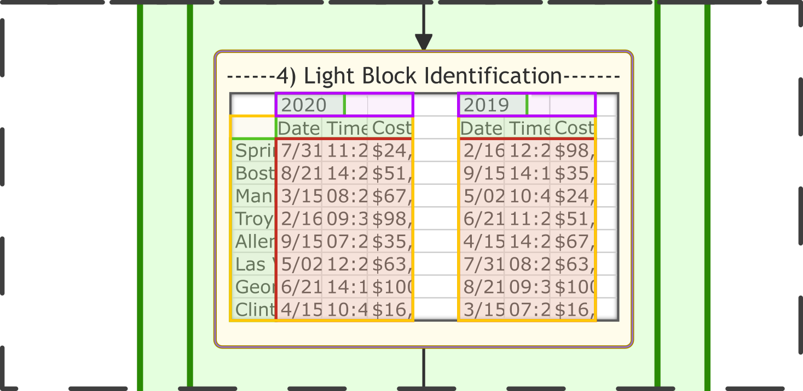

---

# The Excellent Spreadsheet Analysis Algorithm
 *A product of the HARP research team*

---

The goal of this algorithm is to simplify the task of transforming poorly formatted or complex spreadsheets into a tree-like table heirarchy, to allow for easy parsing of known formats.

Currently, the complexity of this task requires either manual parsing(with libraries such as OpenPyxl for Python) or using Large Language Models with significant output capability.***Existing models with the complexity and generality to achieve this task generally tend to be on the order of 7 billlion parameters at the smallest, with replicable results generally only in the range of 30-65 billion paramters.*** This is massively computation inefficicent.

That being said, there are concepts within spreadsheets which would be prohibitavely complex to manually program, and this algorithm supplements these tasks with small models, synthetically trained by LLM's.

This is intended to serve as a proof of concept for the notion of ***Hybrid Synthetic-Symbolic Synthetic-Statistic Neural Networks*** or **Hybrid S4 Networks**. This particular algorithm was developed in collaboration with LLM's, however much of the planning was carried out within an early iteration of our ***Advanced Semantic Engine***, a complex semantic planning framework which will eventually be implemented within a S4 Network. The synthetic model used within this algorithm is trained off of a data set generated by said LLM.

The design principle of this algorithm is to define common patterns within spreadsheets, with more complex patterns being addressed further on. At the end, after processing each example spreadsheet, the examples are compared and the most general description, assuming the least about the structure by keeping block identification flexible, the data is parsed into an output class which can take a spreadsheet and almost instantly parse it into a usable class .

This algorithm serves as a *fine-tuned Spreadsheet-to-Python S4 AI *, where, given a specific training data set, the hybrid system can produce a pattern and tool which uses that pattern to organize other data into a useful format with computational efficiency. This is intended to serve as a library to be integrated within other data-analysis products.

HARP research would like to offer this as a free product for personal or small-scale commercial use, given an easily identifiable badge is integrated into the end use giving credit.

If a badge isn't desired, we will license it out for a licensing fee. For more details, see our licensing agreement.

#### 0) Sheet Chunking

First the sheet is chunked into small blocks, ready to be passed to a very small ML model. The idea is to minimize uncertainty by minimizing the task of the ML model, which is done by restricting the output domain to a binary DATA or LABEL
#### 1) Cell Annotation

Chunks are then passed through our small language model to annotate each cell. This is the base of the algorithm, where cells are categorized as either label cells or data cells, making up the key components of the template. In theory, label cells are constants and data cells are degrees of freedom(DOFs). Due to the probabilistic nature of NLP and DOFs at a higher level than individual cells, such as a series of tables within a sheet, this isn't complex enough to provide adequate data organization.

#### 2) Solid Block Identification

The spreadsheet is then passed through a solid block identifier, identifying rectangular groups of cells. This is to build a basis of the structure of the data
#### 3) Solid Table Identification Pass 1

The blocks are then passed through a table identifier, which groups together blocks into standard tables.

#### 4) Light Block Identification

So-called "light blocks", i.e. data blocks with gaps in the data or labels which, despite being a particular length, actually are associated with larger tables, are extracted via a set of design rules relying on degree of freedom restrictions.
#### 5) Solid Table Pass 2

The tables are then grouped into tables of tables and/or blocks to connect the Light Blocks to new or existing tables.

#### 6) Pattern Table Splitting

After identifying two layers of standard data groupings, there is a table-splitting pass , where tables which have non-prime dimensions (i.e. some number can be multiplied to get to a dimension) are checked for repeats in labeling. If partial patterns are found at this stage, labels which do repeat regularly are maintained, and labels which change are converted to data, giving priority to the left and top most labels within a chunk.

#### 7) Recursive Light Table Identification

After having gotten a fairly-accurate, basic structure of the data, larger patterns with tables of tables, and tables of those tables are formed, building the tree heirarchy of a given spreadsheet.
#### 8) Template Extraction

After building a heirarchy of the spreadsheet structure, it is converted to a format which expressly stores the structure whith all restrictions being expressly accesible. For example, a pattern of two tables within a table will be given expressed within the definition of the parent table, creating the expectation of a simlar pattern in the real data.
#### 9) Multi-Document DOF Comparison

With templates containing express DOF restrictions in hand, the training sheets are compared, with DOFs added as confilcts in training data are found, building a symbolic neural network.
#### 10) Synthetic-Model Export

The newly created generalized template is then exported into an instance of a spreadsheet import class , available for use in any program. If too many DOFs are available, re-running portions of the analysis framework may be required upon import, however given the efficiency of this network it should be little overhead.

Potential future improvements on this library include:
- Adding support for translating and interpreting formulas and macros
- Add a hybrid naming AI which uses context to selectively name the data structures for ease of access
- Training a second hybrid Compatibility Model, which be activated if a spreadsheet format doesnt mach the expected format to try and map the new data to the orginal format. If it isn't readily possible, it will return an error.
- Adding a database format option which can create a vector database of data formats previously added to attempt to improve the compatibility model

© Copyright 2023 by HARP research group, a subsidiary of Tradezone Development, Inc.
