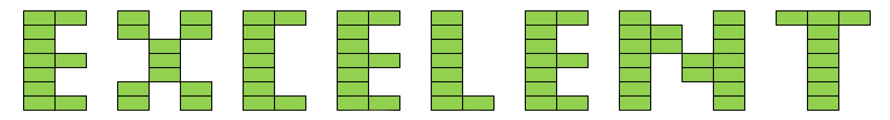

---



# The Excellent Spreadsheet Analysis Algorithm
<span style = "color: gray;" > *A product of the HARP research team*</span>

---

#DEMO

The goal of this demo is to provide a visualization for each step of the algorithm using D3.js, a visualization library for javascript.

The idea is to create an interactive web animation, where the user uploads a spreadsheet, watches as it is broken down, recombined, organized, and returned as a json. 

This particular version will use LLM's in lieu of the algorithm while it is in development.

The current algorithm steps are as follows: 
- Sheet Chunking
- Cell Annotation
- Solid Block Identification
- Solid Table Identification
- Light Block Identification
- Solid Table Pass 2
- Pattern Table Splitting
- Recursive Light Table Identification
- Template Extraction
- Multi-Document DOF Comparison
- Synthetic-Model Export

## I/O
*All 2 object lists and objects within "( )" are tuples*


#### 0) Sheet Chunking
*Takes spreadsheet and chunks it into blocks of cells with a given context window and block size*

##### Input:
- *Chunk Size*
- *Context Size*
```
spreadsheet.csv
```
##### Output:
```
chunked_sheets.json
```

```json
{
    "Owned Properties" : [
        [
            {
                "chunk":[
                    [
                        "A2", 
                        "El Ranchero"
                    ],
                    [
                        "B2", 
                        "Farm"
                    ],
                    [
                        "C2",
                        "10/23/2015"
                    ],
                    [
                        "A3", 
                        "The Appartments on the Hudson"
                    ],
                    [
                        "B3", 
                        "Residential"
                    ],
                    [
                        "C3",
                        "07/15/2016"
                    ],
                ],
                "column_context":[
                ],
                "row_context":[
                    [
                        "A1", 
                        "Property Name"
                    ],
                    [
                        "B1", 
                        "Property Type"
                    ],
                    [
                        "C1",
                        "Date Acquired"
                    ]
                ]
            }
        ]
    ]
}
```


#### 1) Cell Annotation
*Takes chunks of cells and labels them with context of previously annotated cells*
##### Input:
```
chunked_sheets.json
```
##### Output:
```
annotated_cells.json
```
```json
{
    "Owned Properties" : {
        "A1": {
            "value": "Property Name",
            "annotation": "LABEL"
        },
        "B1": {
            "value": "Property Type",
            "annotation": "LABEL"
        },
        "C1": {
            "value": "Date Acquired",
            "annotation": "LABEL"
        },
        "A2": {
            "value": "El Ranchero",
            "annotation": "DATA"
        },
        "B2": {
            "value": "Farm",
            "annotation": "DATA"
        },
        "C2": {
            "value": "10/23/2015",
            "annotation": "DATA"
        },
        "A3": {
            "value": "The Appartments on the Hudson",
            "annotation": "DATA"
        },
        "B3": {
            "value": "Residential",
            "annotation": "DATA"
        },
        "C3": {
            "value": "07/15/2016",
            "annotation": "DATA"
        }
    }
}
```
#### 2) Solid Block Identification
*Combine groups of cells with same annotation next to one another into blocks*
##### Input:
```
annotated_cells.json
```

##### Output:
```
blocks_output.json
```
```json
{
    "Owned Properties" : {
        "LABEL": [
            {
                "start": "(1,1)",
                "end": "(3,1)",
                "cells": {
                    "(1,1)": {
                        "value": "Property Name",
                        "annotation": "LABEL"
                    },
                    "(2,1)": {
                        "value": "Property Type",
                        "annotation": "LABEL"
                    },
                    "(3,1)": {
                        "value": "Date Acquired",
                        "annotation": "LABEL"
                    }
                }
            }],
        "DATA": [
            {
                "start": "(1,2)",
                "end": "(3,3)",
                "cells": {
                    "(1,2)": {
                        "value": "El Ranchero",
                        "annotation": "DATA"
                    },
                    "(2,2)": {
                        "value": "Industrial",
                        "annotation": "DATA"
                    },
                    "(3,2)": {
                        "value": "10/23/2015",
                        "annotation": "DATA"
                    },
                    "(1,3)": {
                        "value": "The Appartments on the Hudson",
                        "annotation": "DATA"
                    },
                    "(2,3)": {
                        "value": "Residential",
                        "annotation": "DATA"
                    },
                    "(3,3)": {
                        "value": "07/15/2016",
                        "annotation": "DATA"
                    }
                }
            }
        ]
    }
}
```

#### 3) Solid Table Identification
*Identify label solid blocks near data solid blocks and combine into tables*
##### Input:
```
blocks_output.json
```
##### Output:
```
solid_table_output.json
```
```json
{
    "Owned Properties": {
        "tables": [
            {
                "data_block": {
                    "start": "(1,2)",
                    "end": "(3,3)",
                    "cells": {
                        "(1,2)": {
                            "value": "El Ranchero",
                            "annotation": "DATA"
                        },
                        "(2,2)": {
                            "value": "Industrial",
                            "annotation": "DATA"
                        },
                        "(3,2)": {
                            "value": "10/23/2015",
                            "annotation": "DATA"
                        },
                        "(1,3)": {
                            "value": "The Appartments on the Hudson",
                            "annotation": "DATA"
                        },
                        "(2,3)": {
                            "value": "Residential",
                            "annotation": "DATA"
                        },
                        "(3,3)": {
                            "value": "07/15/2016",
                            "annotation": "DATA"
                        }
                    },
                    "size": "(3,2)",
                    "start_positions": {
                        "same_height_label_blocks": {
                            "l0": "(null,null)",
                            "l1": "(null,null)",
                            "r0": "(4,2)",
                            "r1": "(5,3)",
                        },
                        "same_width_label_blocks": {
                            "t0": "(1,1)",
                            "t1": "(1, null)",
                            "b0": "(1,4)",
                            "b1": "(1,5)"
                        }
                    }
                },
                "label_blocks": {
                    "t0": {
                        "start": "(1,1)",
                        "end": "(3,1)",
                        "cells": {
                            "(1,1)": {
                                "value": "Property Name",
                                "annotation": "LABEL"
                            },
                            "(2,1)": {
                                "value": "Property Type",
                                "annotation": "LABEL"
                            },
                            "(3,1)": {
                                "value": "Date Acquired",
                                "annotation": "LABEL"
                            }
                        },
                        "size": "(3,1)"
                    }
                }
            }
        ],
        "subtables": [],
        "free_blocks": {
            "LABEL": [],
            "DATA":[]
        }
    }
}
```

#### 4) Solid Table Identification Pass 2
*Turns solid tables into solid tables of solid tables up one level of abstraction in order to make up for mislabeling*
##### Input:
```
solid_table_output.json
```

```json
{
    "Owned Properties": {
        "tables": [
            {
                "data_block": {
                    "start": "(1,2)",
                    "end": "(3,2)",
                    "cells": {
                        "(1,2)": {
                            "value": "El Ranchero",
                            "annotation": "DATA"
                        },
                        "(2,2)": {
                            "value": "Industrial",
                            "annotation": "DATA"
                        },
                        "(3,2)": {
                            "value": "10/23/2015",
                            "annotation": "DATA"
                        },
                    },
                    "size": "(3,1)",
                    "start_positions": {
                        "same_height_label_blocks": {
                            "l0": "(null,null)",
                            "l1": "(null,null)",
                            "r0": "(4,2)",
                            "r1": "(5,3)",
                        },
                        "same_wdith_label_blocks": {
                            "t0": "(1,1)",
                            "t1": "(1, null)",
                            "b0": "(1,4)",
                            "b1": "(1,5)"
                        }
                    }
                },
                "label_blocks": {
                    "t0": {
                        "start": "(1,1)",
                        "end": "(3,1)",
                        "cells": {
                            "(1,1)": {
                                "value": "Property Name",
                                "annotation": "LABEL"
                            },
                            "(2,1)": {
                                "value": "Property Type",
                                "annotation": "LABEL"
                            },
                            "(3,1)": {
                                "value": "Date Acquired",
                                "annotation": "LABEL"
                            }
                        },
                        "size": "(3,1)"
                    }
                },
                "subtables": [],
                "free_blocks":{
            "LABEL": [],
            "DATA": []
},
            }, 
            {
                "data_block": {
                    "start": "(2,3)",
                    "end": "(3,3)",
                    "cells": {
                        "(2,3)": {
                            "value": "Residential",
                            "annotation": "DATA"
                        },
                        "(3,3)": {
                            "value": "07/15/2016",
                            "annotation": "DATA"
                        }
                    },
                    "size": "(2,1)",
                    "start_positions": {
                        "same_height_label_blocks": {
                            "l0": "(1,3)",
                            "l1": "(null,3)",
                            "r0": "(4,3)",
                            "r1": "(5,3)",
                        },
                        "same_width_label_blocks": {
                            "t0": "(2,2)",
                            "t1": "(2,1)",
                            "b0": "(2,4)",
                            "b1": "(1,5)"
                        }
                    }
                },
                "subtables": [],
                "free_blocks":{
            "LABEL": [],
            "DATA": []
},
                "label_blocks": {
                    "t0": {
                        "start": "(1,3)",
                        "end": "(1,3)",
                        "cells": {
                            "(1,3)": {
                                "value": "The Appartments on the Hudson",
                                "annotation": "LABEL"
                            },
                        },
                        "size": "(1,1)"
                    }
                }
            }
        ],
        "free_blocks": {
            "LABEL": [],
            "DATA":[]
        }
    }
}
```
##### Output:
```
layered_solid_table_output.json
```
```json
{
    "Owned Properties": {
        "tables": [
            {
                "data_block": {
                    "start": "(1,2)",
                    "end": "(3,2)",
                    "cells": {
                        "(1,2)": {
                            "value": "El Ranchero",
                            "annotation": "DATA"
                        },
                        "(2,2)": {
                            "value": "Industrial",
                            "annotation": "DATA"
                        },
                        "(3,2)": {
                            "value": "10/23/2015",
                            "annotation": "DATA"
                        },
                    },
                    "size": "(3,1)",
                    "start_positions": {
                        "same_height_label_blocks": {
                            "l0": "(null,null)",
                            "l1": "(null,null)",
                            "r0": "(4,2)",
                            "r1": "(5,3)",
                        },
                        "same_wdith_label_blocks": {
                            "t0": "(1,1)",
                            "t1": "(1, null)",
                            "b0": "(1,4)",
                            "b1": "(1,5)"
                        }
                    }
                },
                "label_blocks": {
                    "t0": {
                        "start": "(1,1)",
                        "end": "(3,1)",
                        "cells": {
                            "(1,1)": {
                                "value": "Property Name",
                                "annotation": "LABEL"
                            },
                            "(2,1)": {
                                "value": "Property Type",
                                "annotation": "LABEL"
                            },
                            "(3,1)": {
                                "value": "Date Acquired",
                                "annotation": "LABEL"
                            }
                        },
                        "size": "(3,1)"
                    }
                },
                "subtables": [  
                    {
                        "data_block": {
                            "start": "(2,3)",
                            "end": "(3,3)",
                            "cells": {
                                "(2,3)": {
                                    "value": "Residential",
                                    "annotation": "DATA"
                                },
                                "(3,3)": {
                                    "value": "07/15/2016",
                                    "annotation": "DATA"
                                }
                            },
                            "size": "(2,1)",
                            "start_positions": {
                                "same_height_label_blocks": {
                                    "l0": "(1,3)",
                                    "l1": "(null,3)",
                                    "r0": "(4,3)",
                                    "r1": "(5,3)",
                                },
                                "same_width_label_blocks": {
                                    "t0": "(2,2)",
                                    "t1": "(2,1)",
                                    "b0": "(2,4)",
                                    "b1": "(1,5)"
                                }
                            }
                        },
                        "subtables": [],
                "free_blocks":{
            "LABEL": [],
            "DATA": []
},
                        "label_blocks": {
                            "t0": {
                                "start": "(1,3)",
                                "end": "(1,3)",
                                "cells": {
                                    "(1,3)": {
                                        "value": "The Appartments on the Hudson",
                                        "annotation": "LABEL"
                                    },
                                },
                                "size": "(1,1)"
                            }
                        }
                    }
                ],
            },
        ],
        "free_blocks": {
            "LABEL": [],
            "DATA":[]
        }
    }
}
```
#### 5) Light Block Identification
*take blocks that are unattached to tables, check for tables next to or one off from tables, following same order of priority of ST_ID connections*
*checks for lables with gaps by existing tables*
*checks for data blocks based on AB, BB, and CB patterns*

##### Light Label:
```csv
                ,LABEL: "Sales Data" ,
                ,LABEL: "Date"       ,LABEL: "Sales" ,
LABEL: "Store1" ,DATA: "12/01/2023"  ,DATA: "$1000"  ,
LABEL: "Store2" ,DATA: "12/01/2023"  ,DATA: "$2000"  ,
LABEL: "Store3" ,DATA: "12/01/2023"  ,DATA: "$1500"  ,
```

##### Pattern AB: 
A set of Data Blocks made up of continuous (i.e. no gaps between the blocks) in the y direction, row by row, and  Blocks with gaps between them in the x direction, column by column connected with a set of Label blocks, continuous (i.e. no gaps between the blocks) in the x direction, column by column if a given label block is in t0, t1, b0, or b1 position, and Blocks with gaps between them in the y, row by row, with different heights if a given label block is in l0, l1, r0, or r1 position

*Example:*
```csv
                            ,LABEL: "Date"        ,LABEL: "Time" ,LABEL: "Address", 
LABEL: "George Costanza"    ,DATA: "10/12/2023"   ,              ,DATA: "1600 Burdette Ave, Troy NY",
                            ,DATA: "09/01/2002"   ,              ,DATA: "35 Wagon Wheel Trail, CLinton NJ",
LABEL: "Harper Giorgo"      ,DATA: "11/22/1963"   ,              ,DATA: "10 Pennsylvania Ave, Washington DC",
```
```csv
                        ,LABEL: "Date"            ,LABEL: "Email"    ,LABEL: "Country"
LABEL: "User1"          ,DATA: "12/01/2023"       ,                  ,DATA: "USA"
                        ,DATA: "01/02/2023"       ,                  ,DATA: "USA"
LABEL: "User2"          ,DATA: "11/05/2023"       ,                  ,DATA: "UK"
                        ,DATA: "12/06/2023"       ,                  ,DATA: "UK"

```
##### Pattern BB: 
A set of Data Blocks made up of Blocks with gaps between them in the y, row by row, with different heights and continuous (i.e. no gaps between the blocks) in the x direction, column by column, connected with a set of Label blocks, Blocks with gaps between them in the x direction, column by column if a given label block is in t0, t1, b0, or b1 position and continuous (i.e. no gaps between the blocks) in the y direction, row by row if a given label block is in l0, l1, r0, or r1 position


*Example:*
```csv
                            ,LABEL: "Date"        ,LABEL: "Time" ,  LABEL: "Address",
LABEL: "George Costanza"    ,DATA: "10/12/2023"   ,DATA: "10:15" ,DATA: "1600 Burdette Ave, Troy NY"
LABEL: "Bill Jeofry"        ,                     ,              ,
LABEL: "Harper Giorgo"      ,DATA: "11/22/1963"   ,DATA: "13:45" ,DATA: "10 Pennsylvania Ave, Washington DC",
```
```csv
                           ,LABEL: "Date"       ,LABEL: "Time" ,             ,LABEL: "Job Title",
LABEL: "George Costanza"   ,DATA: "10/12/2023"  ,DATA: "10:15" ,DATA: "USA"          ,DATA: "Architect",
LABEL: "John Doe"          ,                     ,              ,                     ,
LABEL: "Harper Giorgo"     ,DATA: "11/22/1963"  ,DATA: "13:45" ,DATA: "UK"           ,DATA: "Engineer",
LABEL: "Emma Watson"       ,                     ,              ,                     ,
LABEL: "Marry Jane"        ,DATA: "06/21/1990"  ,DATA: "15:30" ,DATA: "Australia"    ,DATA: "Doctor",
```

##### Pattern CB:
 A set of Data Blocks made up of  Blocks with gaps between them in the x direction, column by column and Blocks with gaps between them in the y, row by row, with different heights connected with a set of Label blocks, continuous (i.e. no gaps between the blocks) in the x direction if a given label block is in l0, l1, r0, or r1 position, and column by column and continuous (i.e. no gaps between the blocks) in the y direction, row by row if a given label block is in l0, l1, r0, or r1 position


*Example:*
```csv
                            ,LABEL: "Date"        ,LABEL: "Time" ,LABEL: "Address"   , 
LABEL: "George Costanza"    ,DATA: "10/12/2023"   ,DATA: "10:15" ,                   ,
LABEL: "Bill Jeofry"        ,DATA: "09/01/2002"   ,              ,DATA: "1600 Burdette Ave, Troy NY",
LABEL: "Harper Giorgo"      ,                     ,DATA: "13:45" ,DATA: "10 Pennsylvania Ave, Washington DC"
```
```csv
                             ,LABEL: "Date"        ,LABEL: "Salary" ,
LABEL: "Employee 1"         ,DATA: "01/01/2023"   ,                 ,
                            ,DATA: "02/01/2023"   ,                 ,
LABEL: "Employee 2"         ,                      ,DATA: "$5000"   ,

                             ,LABEL: "Date"        ,LABEL: "Salary" ,
LABEL: "Employee 3"         ,DATA: "03/01/2023"   ,                 ,
                            ,DATA: "04/01/2023"   ,                 ,
LABEL: "Employee 4"         ,                      ,DATA: "$6000"   ,

```
```CSV
                            ,LABEL: "Date"       ,LABEL: "Email"         ,LABEL: "Country"     ,LABEL: "Age" ,
LABEL: "User1"             ,DATA: "12/01/2023"   ,DATA: "user1@mail.com" ,DATA: "USA"          ,DATA: "35"   ,
LABEL: "User2"             ,                     ,                       ,                      ,              ,
LABEL: "User3"             ,DATA: "11/05/2023"   ,DATA: "user3@mail.com" ,DATA: "UK"           ,DATA: "45"   ,
LABEL: "User4"             ,DATA: "10/07/2023"   ,                       ,DATA: "Australia"    ,              ,
LABEL: "User5"             ,                     ,DATA: "user5@mail.com" ,                      ,DATA: "30"   ,
```
```CSV
                            ,LABEL: "Date"       ,LABEL: "Time"  ,LABEL: "Country"      ,LABEL: "Age"  ,LABEL: "Job Title",
LABEL: "George Costanza"    ,DATA: "10/12/2023"  ,DATA: "10:15"  ,DATA: "USA"           ,DATA: "40"    ,DATA: "Architect",
LABEL: "Bill Jeofry"        ,                    ,               ,                       ,              ,
LABEL: "Harper Giorgo"      ,DATA: "11/22/1963"  ,DATA: "13:45"  ,DATA: "UK"            ,DATA: "55"    ,DATA: "Engineer",
LABEL: "Susie Carmichael"   ,DATA: "05/18/1991"  ,               ,DATA: "Canada"        ,              ,DATA: "Doctor",
LABEL: "Albert Smith"       ,                    ,DATA: "15:30"  ,                       ,DATA: "65"    ,DATA: "Retired",
```
##### Input:
```
layered_solid_table_output.json
```

##### Output:
```
layered_light_block_output.json
```
```json
{
    "Sales Data": {
        "tables": [
            {
                "data_block": {
                    "start": "(2,2)",
                    "end": "(4,3)",
                    "cells": {
                        "(2,2)": {
                            "value": "12/01/2023",
                            "annotation": "DATA"
                        },
                        "(2,3)": {
                            "value": "$1000",
                            "annotation": "DATA"
                        },
                        "(3,2)": {
                            "value": "12/01/2023",
                            "annotation": "DATA"
                        },
                        "(3,3)": {
                            "value": "$2000",
                            "annotation": "DATA"
                        },
                        "(4,2)": {
                            "value": "12/01/2023",
                            "annotation": "DATA"
                        },
                        "(4,3)": {
                            "value": "$1500",
                            "annotation": "DATA"
                        }
                    },
                    "size": "(3,2)"
                },
                "label_blocks": {
                    "t0": {
                        "start": "(1,2)",
                        "end": "(1,3)",
                        "cells": {
                            "(1,2)": {
                                "value": "Date",
                                "annotation": "LABEL"
                            },
                            "(1,3)": {
                                "value": "Sales",
                                "annotation": "LABEL"
                            }
                        },
                        "size": "(1,2)"
                    },
                    "l0": {
                        "start": "(2,1)",
                        "end": "(4,1)",
                        "cells": {
                            "(2,1)": {
                                "value": "Store1",
                                "annotation": "LABEL"
                            },
                            "(3,1)": {
                                "value": "Store2",
                                "annotation": "LABEL"
                            },
                            "(4,1)": {
                                "value": "Store3",
                                "annotation": "LABEL"
                            }
                        },
                        "size": "(3,1)"
                    },
                    "label_light_block": {
                        "start": "(1,2)",
                        "end": "(1,3)",
                        "cells": {
                            "(1,2)": {
                                "value": "Sales Data",
                                "annotation": "LABEL"
                            }
                        },
                        "size": "(1,2)"
                    }
                }
            }
        ]
    }
}

```
```json
{
    "Spreadsheet Pattern BB": {
        "tables": [
            {
                "data_block": {
                    "start": "(2,2)",
                    "end": "(5,6)",
                    "cells": {
                        "(2,2)": {
                            "value": "10/12/2023",
                            "annotation": "DATA"
                        },
                        "(2,3)": {
                            "value": "10:15",
                            "annotation": "DATA"
                        },
                        "(2,4)": {
                            "value": "USA",
                            "annotation": "DATA"
                        },
                        "(2,5)": {
                            "value": "Architect",
                            "annotation": "DATA"
                        },
                        "(4,2)": {
                            "value": "11/22/1963",
                            "annotation": "DATA"
                        },
                        "(4,3)": {
                            "value": "13:45",
                            "annotation": "DATA"
                        },
                        "(4,4)": {
                            "value": "UK",
                            "annotation": "DATA"
                        },
                        "(4,5)": {
                            "value": "Engineer",
                            "annotation": "DATA"
                        },
                        "(6,2)": {
                            "value": "06/21/1990",
                            "annotation": "DATA"
                        },
                        "(6,3)": {
                            "value": "15:30",
                            "annotation": "DATA"
                        },
                        "(6,4)": {
                            "value": "Australia",
                            "annotation": "DATA"
                        },
                        "(6,5)": {
                            "value": "Doctor",
                            "annotation": "DATA"
                        }
                    },
                    "size": "(5,5)",
                    "start_positions": {
                        "same_height_label_blocks": {
                            "l0": "(2,1)",
                            "l1": "(null,null)",
                            "r0": "(null,2)",
                            "r1": "(null,6)"
                        },
                        "same_width_label_blocks": {
                            "t0": "(1,2)",
                            "t1": "(null,2)",
                            "b0": "(1,6)",
                            "b1": "(null,6)"
                        }
                    }
                },
                "label_blocks": {
                    "t0": {
                        "start": "(1,2)",
                        "end": "(1,6)",
                        "cells": {
                            "(1,2)": {
                                "value": "Date",
                                "annotation": "LABEL"
                            },
                            "(1,3)": {
                                "value": "Time",
                                "annotation": "LABEL"
                            },
                            "(1,4)": {
                                "value": "Country",
                                "annotation": "LABEL"
                            },
                            "(1,5)": {
                                "value": "Job Title",
                                "annotation": "LABEL"
                            }
                        },
                        "size": "(1,5)"
                    },
                    "l0": {
                        "start": "(2,1)",
                        "end": "(6,1)",
                        "cells": {
                            "(2,1)": {
                                "value": "George Costanza",
                                "annotation": "LABEL"
                            },
                            "(3,1)":{
                                "value" : "John Doe",
                                "annotation": "LABEL"
                            },
                            "(4,1)": {
                                "value": "Harper Giorgo",
                                "annotation": "LABEL"
                            },,
                            "(5,1)":{
                                "value" : "Emma Watson",
                                "annotation": "LABEL"
                            },
                            "(6,1)": {
                                "value": "Marry Jane",
                                "annotation": "LABEL"
                            }
                        },
                        "size": "(5,1)"
                    }
                },
                "subtables": [],
                "free_blocks":{
                    "LABEL": [],
                    "DATA": []
                }
            }
        ],
        "free_blocks": {
            "LABEL": [],
            "DATA": []
        }
    }
}

```

#### 6) Pattern Table Splitting
*Goes through tables and checks for patterns in non-prime sized tables (non-prime x length tables excluding labels for splitting in x, non-prime y length tables excluding labels for splitting in y)*
*Exmaple In:*
```csv
                     ,LABEL: "Date"         ,LABEL: "Time"  ,LABEL: "Date"     ,LABEL: "Time",
LABEL: "User1"       ,DATA: "12/01/2023"    ,DATA: "10:15"  ,DATA: "12/01/2024",DATA: "10:15",
LABEL: "User2"       ,DATA: "11/02/2023"    ,DATA: "11:30"  ,DATA: "11/02/2024",DATA: "11:30",
LABEL: "User3"       ,DATA: "10/05/2023"    ,DATA: "12:45"  ,DATA: "10/05/2024",DATA: "12:45",
```
*Example Out:*

Table 1:

Subtable 1
```csv
                     ,LABEL: "Date"         ,LABEL: "Time",
LABEL: "User1"       ,DATA: "12/01/2023"    ,DATA: "10:15",
LABEL: "User2"       ,DATA: "11/02/2023"    ,DATA: "11:30",
LABEL: "User3"       ,DATA: "10/05/2023"    ,DATA: "12:45",
```
Subtable 2
```csv
                     ,LABEL: "Date"         ,LABEL: "Time",
LABEL: "User1"       ,DATA: "12/01/2024"    ,DATA: "10:15",
LABEL: "User2"       ,DATA: "11/02/2024"    ,DATA: "11:30",
LABEL: "User3"       ,DATA: "10/05/2024"    ,DATA: "12:45",

```

##### Input:
```
layered_light_block_output.json
```
##### Output:
```
pattern_split_LB.json
```


#### 7) Recursive Light Table Identification
Recursively turns solid and light tables into tables of tables into a tree structure, similar in principle to LB_ID
*Example In:*
```csv
                            ,LABEL: "Date"        ,LABEL: "Time" ,LABEL: "Country",
LABEL: "George Costanza"    ,DATA: "10/12/2023"   ,DATA: "10:15" ,DATA: "USA",
LABEL: "Bill Jeofry"        ,DATA: "09/01/2002"   ,DATA: "14:30" ,DATA: "UK",
LABEL: "Harper Giorgo"      ,DATA: "11/22/1963"   ,DATA: "13:45" ,DATA: "Canada",
                            ,LABEL: "Book Title"  ,LABEL: "Author",
LABEL: "George Costanza"    ,DATA: "The Art of War" ,DATA: "Sun Tzu",
                            ,LABEL: "Book Title"  ,LABEL: "Author",
LABEL: "Harper Giorgo"      ,DATA: "1984"         ,DATA: "George Orwell",

```
*Example Out:*
Table 1:
Table_1/Table_1:
```csv
                            ,LABEL: "Date"        ,LABEL: "Time" ,LABEL: "Country",
LABEL: "George Costanza"    ,DATA: "10/12/2023"   ,DATA: "10:15" ,DATA: "USA",
LABEL: "Bill Jeofry"        ,DATA: "09/01/2002"   ,DATA: "14:30" ,DATA: "UK",
LABEL: "Harper Giorgo"      ,DATA: "11/22/1963"   ,DATA: "13:45" ,DATA: "Canada",
```
Table_1/Table_2:
Table_1/Table_2/Table_1:
```csv
                            ,LABEL: "Book Title"  ,LABEL: "Author",
LABEL: "George Costanza"    ,DATA: "The Art of War" ,DATA: "Sun Tzu",
```
Table_1/Table_2/Table_2:
```csv
                            ,LABEL: "Book Title"  ,LABEL: "Author",
LABEL: "Harper Giorgo"      ,DATA: "1984"         ,DATA: "George Orwell",
```
##### Input:
```
pattern_split_LB.json
```
```json
{
    "sheet_name" : {
        {   
            "pattern": null,
            "expected_start": "(1,1)",
            "size": "(4,8)",
            "t0": [],
            "t1": [],
            ...
            "subtables" : [
                {
                    "pattern": null,
                    "expected_start": "(1,1)",
                    "size": "(4,4)",
                    "t0": [
                        "Date",
                        "Time",
                        "Country",
                    ],
                    "l0": [
                        "George Costanza",
                        "Bill Jeofry",
                        "Harper Giorgo"
                    ],
                    "l1" : [],
                    ...
                    "subtables" : [],
                    "free_blocks" : {
                        "LABEL": [],
                        "DATA": []
                    },
                },
                {
                    "pattern": null,
                    "expected_start": "(1,5)",
                    "size": "(3,4)",
                    "t0": [
                        "Book Title",
                        "Author",
                    ],
                    "l0": [
                        "Bill Jeofry",
                    ],
                    "l1" : [],
                    ...
                    "subtables" : [],
                    "free_blocks" : {
                        "LABEL": [],
                        "DATA": []
                    },
                },
                {
                    "pattern": null,
                    "expected_start": "(1,5)",
                    "size": "(3,4)",
                    "t0": [
                        "Book Title",
                        "Author",
                    ],
                    "l0": [
                        "Harper Giorgio",
                    ],
                    "l1" : [],
                    ...
                    "subtables" : [],
                    "free_blocks" : {
                        "LABEL": [],
                        "DATA": []
                    },
                }
            ]
        }
    },
}
```
##### Output:
```
table_tree.json
```
```json
{
    "sheet_name" : {
        {   
            "pattern": null,
            "expected_start": "(1,1)",
            "size": "(4,8)",
            "t0": [],
            "t1": [],
            ...
            "subtables" : [
                {
                    "pattern": null,
                    "expected_start": "(1,1)",
                    "size": "(4,4)",
                    "t0": [
                        "Date",
                        "Time",
                        "Country",
                    ],
                    "l0": [
                        "George Costanza",
                        "Bill Jeofry",
                        "Harper Giorgo"
                    ],
                    "l1" : [],
                    ...
                    "subtables" : [],
                    "free_blocks" : {
                        "LABEL": [],
                        "DATA": []
                    },
                },
                {
                    "pattern": null,
                    "expected_start": "(1,5)",
                    "size": "(3,4)",
                    "t0": [
                        "Book Title",
                        "Author",
                    ],
                    "l0": [
                        "Bill Jeofry",
                    ],
                    "l1" : [],
                    ...
                    "subtables" : [],
                    "free_blocks" : {
                        "LABEL": [],
                        "DATA": []
                    },
                },
                {
                    "pattern": null,
                    "expected_start": "(1,5)",
                    "size": "(3,4)",
                    "t0": [
                        "Book Title",
                        "Author",
                    ],
                    "l0": [
                        "Bill Jeofry",
                    ],
                    "l1" : [],
                    ...
                    "subtables" : [],
                    "free_blocks" : {
                        "LABEL": [],
                        "DATA": []
                    },
                }
            ]
        }
    },
}
```

#### 8) Template Extraction
turns the organized sheet trees into templates, with every potential DOF listed
*Example In:*
```csv
LABEL: "AMAZON BOOKS"
LABEL: "Purchase Locations"
                            ,LABEL: "Date"        ,LABEL: "Time" ,LABEL: "Country",
LABEL: "George Costanza"    ,DATA: "10/12/2023"   ,DATA: "10:15" ,DATA: "USA",
LABEL: "Bill Jeofry"        ,DATA: "09/01/2002"   ,DATA: "14:30" ,DATA: "UK",
LABEL: "Harper Giorgo"      ,DATA: "11/22/1963"   ,DATA: "13:45" ,DATA: "Canada",

LABEL: "Books"
                            ,LABEL: "Book Title"  ,LABEL: "Author",
LABEL: "George Costanza"    ,DATA: "The Art of War" ,DATA: "Sun Tzu",
                            ,LABEL: "Book Title"  ,LABEL: "Author",
LABEL: "Harper Giorgo"      ,DATA: "1984"         ,DATA: "George Orwell",

```
##### Input:
```
table_tree.json
```
```json
{
    "sheet_name" : [
        {   
            "pattern": null,
            "expected_start": "(1,1)",
            "size": "(4,10)",
            "t0": ["AMAZON BOOKS"],
            "t1": [],
            ...
            "subtables" : [
                {
                    "pattern": null,
                    "expected_start": "(1,1)",
                    "size": "(4,4)",
                    "t0": [
                        "Date",
                        "Time",
                        "Country",
                    ],
                    "t1": [
                        "Purchase Locations"
                    ]
                    "l0": [
                        "George Costanza",
                        "Bill Jeofry",
                        "Harper Giorgo"
                    ],
                    "l1" : [],
                    ...
                    "subtables" : [],
                    "free_blocks" : {
                        "LABEL": [],
                        "DATA": []
                    },
                },
                {
                    "pattern": null,
                    "expected_start": "(1,5)",
                    "size": "(3,4)",
                    "t0": [
                        "Book Title",
                        "Author",
                    ],
                    "t1": [
                        "BOOKS"
                    ]
                    "l0": [
                        "Bill Jeofry",
                    ],
                    "l1" : [],
                    ...
                    "subtables" : [],
                    "free_blocks" : {
                        "LABEL": [],
                        "DATA": []
                    },
                },
                {
                    "pattern": null,
                    "expected_start": "(1,5)",
                    "size": "(3,4)",
                    "t0": [
                        "Book Title",
                        "Author",
                    ],
                    "l0": [
                        "Bill Jeofry",
                    ],
                    "l1" : [],
                    ...
                    "subtables" : [],
                    "free_blocks" : {
                        "LABEL": [],
                        "DATA": []
                    },
                }
            ],
            "free_blocks" : {
                "LABEL": []
                "DATA": []
            },
        }
    ]
}
```

##### Output:
```
template_tree.json
```

```json
{
    "sheet_name" : {
        {   
            "pattern": null,
            "expected_start": "(1,1)",
            "size": "(4,8)",
            "t0": [
                "AMAZON BOOKS"
            ],
            "t1": [],
            ...
            "subtables" : [
                {
                    "pattern": null,
                    "expected_start": "(1,1)",
                    "size": "(4,4)",
                    "t0": [
                        "Date",
                        "Time",
                        "Country",
                    ],
                    "t1": [
                        "Purchase Locations"
                    ]
                    "l0": [
                        "George Costanza",
                        "Bill Jeofry",
                        "Harper Giorgo"
                    ],
                    "l1" : [],
                    ...
                    "subtables" : [],
                    "free_blocks" : {
                        "LABEL": [],
                        "DATA": []
                    },
                },
                {
                    "pattern": "",
                    "expected_start": "(1,5)",
                    "size": "(3,4)",
                    "t0": [
                        "Book Title",
                        "Author",
                    ],
                    "l0": [
                        "Bill Jeofry",
                    ],
                    "l1" : [],
                    ...
                    "subtables" : [],
                    "free_blocks" : {
                        "LABEL": [],
                        "DATA": []
                    },
                },
                {
                    "pattern": "l0",
                    "expected_start": "(1,5)",
                    "size": "(3,4)",
                    "t0": [
                        "Book Title",
                        "Author",
                    ],
                    "t1": [
                        "BOOKS"
                    ],
                    "l0": [
                        "George Costanza"
                        "Harper Giorgo",
                    ],
                    "l1" : [],
                    ...
                    "subtables" : [],
                    "free_blocks" : {
                        "LABEL": [],
                        "DATA": []
                    },
                }
            ]
        }
    },
}
```
#### 9) Multi-Document DOF Comparison
*Using Generalized Trees or Least Common Ancestor(LCA) to compare DOFs in template trees to find the most general tree*
*Example In:*
Sheet 1:
```csv
LABEL: "AMAZON BOOKS"
LABEL: "Purchase Locations"
                            ,LABEL: "Date"        ,LABEL: "Time" ,LABEL: "Country",
LABEL: "George Costanza"    ,DATA: "10/12/2023"   ,DATA: "10:15" ,DATA: "USA",
LABEL: "Bill Jeofry"        ,DATA: "09/01/2002"   ,DATA: "14:30" ,DATA: "UK",
LABEL: "Harper Giorgo"      ,DATA: "11/22/1963"   ,DATA: "13:45" ,DATA: "Canada",

LABEL: "Books"
                            ,LABEL: "Book Title"  ,LABEL: "Author",
LABEL: "George Costanza"    ,DATA: "The Art of War" ,DATA: "Sun Tzu",
LABEL: "Harper Giorgo"      ,DATA: "1984"         ,DATA: "George Orwell",
```
Sheet 2:
```csv
LABEL: "AMAZON BOOKS"
LABEL: "Purchase Locations"
                            ,LABEL: "Date"        ,LABEL: "Time" ,LABEL: "Country",
LABEL: "George Costanza"    ,DATA: "11/05/2023"   ,DATA: "10:15" ,DATA: "USA",
LABEL: "Bill Jeofry"        ,DATA: "05/02/2002"   ,DATA: "14:30" ,DATA: "UK",
LABEL: "Tom Riddle"         ,DATA: "01/22/1983"   ,DATA: "13:45" ,DATA: "USA",

LABEL: "Books"
                            ,LABEL: "Book Title"  ,LABEL: "Author",
LABEL: "George Costanza"    ,DATA: "The Art of War" ,DATA: "Sun Tzu",
LABEL: "Tom Riddle"         ,DATA: "The Chamber of Secrets" ,DATA: "J.K. Rowling",
```
##### Input:
```
template_tree_1.json
template_tree_2.json
...
```
Spreadsheet 1

```json
{
    "sheet_name" : {
        "pattern": null,
        "expected_start": "(1,1)",
        "size": "(4,8)",
        "t0": [
            "AMAZON BOOKS"
        ],
        "t1": [],
        "subtables" : [
            {
                "pattern": null,
                "expected_start": "(1,1)",
                "size": "(4,4)",
                "t0": [
                    "Date",
                    "Time",
                    "Country"
                ],
                "t1": [
                    "Purchase Locations"
                ],
                "l0": [
                    "George Costanza",
                    "Bill Jeofry",
                    "Harper Giorgo"
                ],
                "l1" : [],
                "subtables" : [],
                "free_blocks" : {
                    "LABEL": [],
                    "DATA": []
                },
            },
            {
                "pattern": "",
                "expected_start": "(1,5)",
                "size": "(3,4)",
                "t0": [
                    "Book Title",
                    "Author"
                ],
                "l0": [
                    "George Costanza",
                    "Harper Giorgo"
                ],
                "l1" : [],
                "subtables" : [],
                "free_blocks" : {
                    "LABEL": [],
                    "DATA": []
                },
            }
        ]
    }
}
```
Spreadsheet 2:
```json
{
    "sheet_name" : {
        "pattern": null,
        "expected_start": "(1,1)",
        "size": "(4,8)",
        "t0": [
            "AMAZON BOOKS"
        ],
        "t1": [],
        "subtables" : [
            {
                "pattern": null,
                "expected_start": "(1,1)",
                "size": "(4,4)",
                "t0": [
                    "Date",
                    "Time",
                    "Country"
                ],
                "t1": [
                    "Purchase Locations"
                ],
                "l0": [
                    "George Costanza",
                    "Bill Jeofry",
                    "Tom Riddle"
                ],
                "l1" : [],
                "subtables" : [],
                "free_blocks" : {
                    "LABEL": [],
                    "DATA": []
                },
            },
            {
                "pattern": "",
                "expected_start": "(1,5)",
                "size": "(3,4)",
                "t0": [
                    "Book Title",
                    "Author"
                ],
                "l0": [
                    "George Costanza",
                    "Tom Riddle"
                ],
                "l1" : [],
                "subtables" : [],
                "free_blocks" : {
                    "LABEL": [],
                    "DATA": []
                },
            }
        ]
    }
}
```
##### Output:
```
generalized_template_tree.json
```
```json
{
    "sheet_name" : {
        "pattern": null,
        "expected_start": "(1,1)",
        "size": "(4,8)",
        "t0": [
            "DOF"
        ],
        "t1": [],
        "subtables" : [
            {
                "pattern": null,
                "expected_start": "(1,1)",
                "size": "(4,4)",
                "t0": [
                    "Date",
                    "Time",
                    "Country"
                ],
                "t1": [
                    "Purchase Locations"
                ],
                "l0": [
                    "DOF",
                    "DOF",
                    "DOF"
                ],
                "l1" : [],
                "subtables" : [],
                "free_blocks" : {
                    "LABEL": [],
                    "DATA": []
                },
            },
            {
                "pattern": "l0",
                "expected_start": "(1,5)",
                "size": "(3,4)",
                "t0": [
                    "Book Title",
                    "Author"
                ],
                "l0": [
                    "DOF",
                    "DOF"
                ],
                "l1" : [],
                "subtables" : [],
                "free_blocks" : {
                    "LABEL": [],
                    "DATA": []
                },
            }
        ]
    }
}
```
#### 10) Synthetic-Model Export
##### Input:
```
chunked_sheets.json
```
##### Output:
```
template_sheet.json
sheet_instances.json
```
Spreadsheet 1:
```json
{
    "AMAZON BOOKS": {
        "Purchase Locations": [
            {
                "George Costanza": {
                    "Date": "10/12/2023",
                    "Time": "10:15",
                    "Country": "USA",
                },
                "Harper Giorgio": {
                    "Date": "11/22/1963",
                    "Time": "13:45",
                    "Country": "Canada",
                },
                "Bill Jeofry":{
                    "Date": "09/01/2002",
                    "Time": "14:30",
                    "Country": "UK",
                }
            }
        ],
        "Books" : [
            {
                "Harper Giorgo" : {
                    "Book Title": "1984",
                    "Author": "George Orwell"
                },
                "George Costanza" : {
                    "Book Title": "The Art of War",
                    "Author": "Sun Tzu"
                }
            }
        ]
    }
}
```
Spreadsheet 2:
```json
{
    "AMAZON BOOKS": {
        "Purchase Locations": [
            {
                "George Costanza": {
                    "Date": "11/05/2023",
                    "Time": "10:15",
                    "Country": "USA"
                },
                "Bill Jeofry": {
                    "Date": "05/02/2002",
                    "Time": "14:30",
                    "Country": "UK"
                },
                "Tom Riddle": {
                    "Date": "01/22/1983",
                    "Time": "13:45",
                    "Country": "USA"
                }
            }
        ],
        "Books": [
            {
                "George Costanza": {
                    "Book Title": "The Art of War",
                    "Author": "Sun Tzu"
                },
                "Tom Riddle": {
                    "Book Title": "The Chamber of Secrets",
                    "Author": "J.K. Rowling"
                }
            }
        ]
    }
}
```
Format JSON:
```json
{
    "sheet_name" : {
        "pattern": null,
        "expected_start": "(1,1)",
        "size": "(4,8)",
        "t0": [
            "DOF"
        ],
        "t1": [],
        "subtables" : [
            {
                "pattern": null,
                "expected_start": "(1,1)",
                "size": "(4,4)",
                "t0": [
                    "Date",
                    "Time",
                    "Country"
                ],
                "t1": [
                    "Purchase Locations"
                ],
                "l0": [
                    "DOF",
                    "DOF",
                    "DOF"
                ],
                "l1" : [],
                "subtables" : [],
                "free_blocks" : {
                    "LABEL": [],
                    "DATA": []
                },
            },
            {
                "pattern": "l0",
                "expected_start": "(1,5)",
                "size": "(3,4)",
                "t0": [
                    "Book Title",
                    "Author"
                ],
                "l0": [
                    "DOF",
                    "DOF"
                ],
                "l1" : [],
                "subtables" : [],
                "free_blocks" : {
                    "LABEL": [],
                    "DATA": []
                },
            }
        ]
    }
}
```